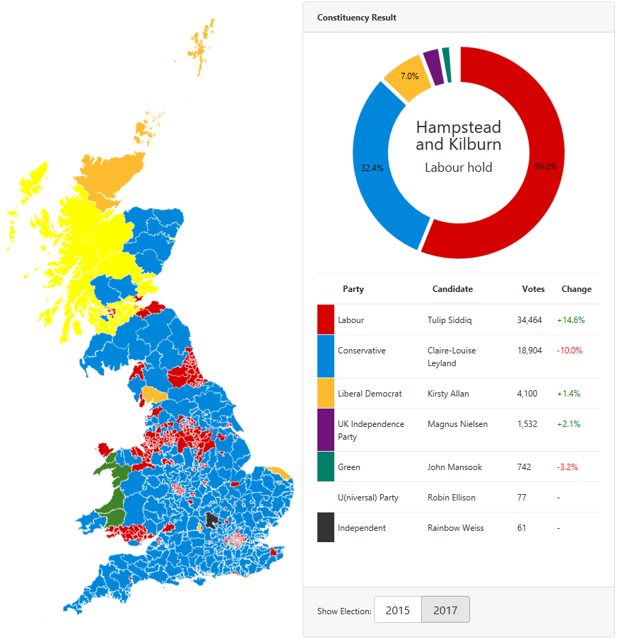
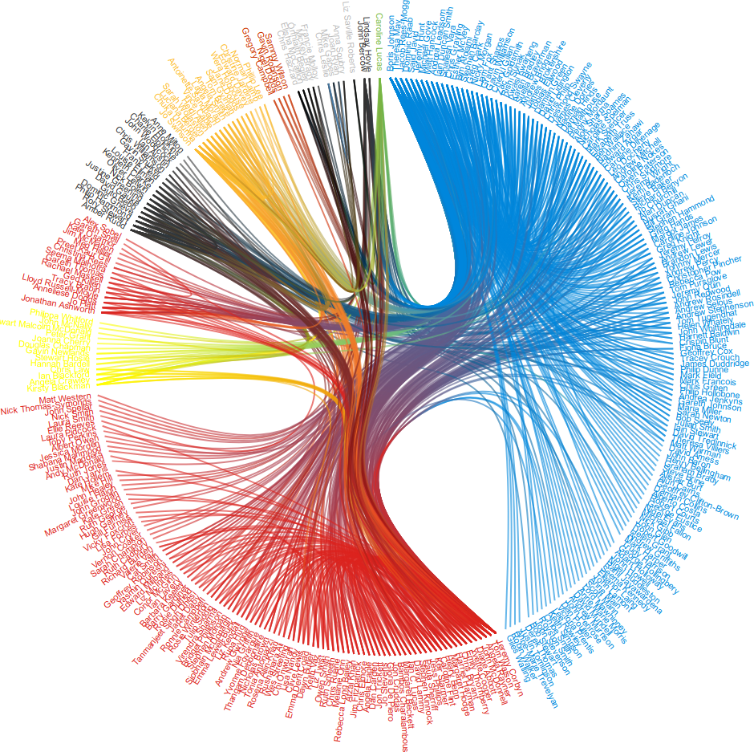

# d3-prototypes
Various visualisations built using d3.js, using publicly available datasets.

---
| Module | Screenshot | Summary |
| ------ | ---------- | ------- |
|__UK General Elections__||__An interactive map with the results of the UK General Elections of 2015 and 2017.__ This prototype shows a zoomable map containing all United Kingdom constituencies, coloured according to the outcome of the General Elections held in 2015 and 2017. Hovering over a constituency shows a breakdown of the vote shares, including an overview of the candidate names, their political party, the total number of votes and the vote share. __[► Live demo](https://wietze.github.io/d3-prototypes/uk-general-elections/index.html)__ |
|__MP Relations__|| __Shows the relationship between MPs in the media.__  The script gets all current MPs from House of Commons API and cross-matches each MP using The Guardian's Open Platform to see if two MPs are mentioned it the same article. The result is a [hierarchical edge layout](https://bl.ocks.org/mbostock/7607999) showing relationships between MPs, clustered by party. Hovering over the names of the MPs will highlight the relationships of the MP in question. __[► Live demo](https://wietze.github.io/d3-prototypes/mp-relations/index.html)__|
